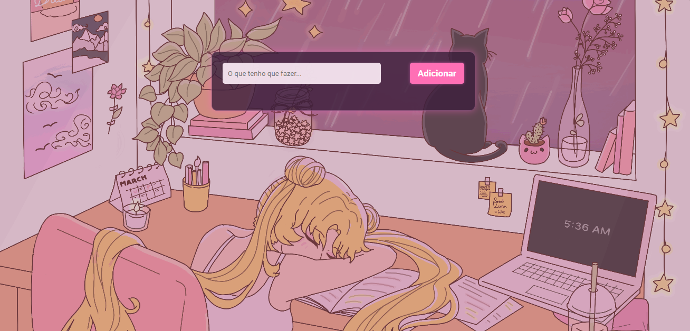

#  To Do List

Este é um projeto de **lista de tarefas** feito com **HTML, CSS e JavaScript**.

- 💗 Acesse: https://todolistemy.netlify.app/

## 🌟 Funcionalidades

- Adicionar novas tarefas.
- Marcar tarefas como concluídas.
- Deletar tarefas.
- Salvar tarefas no navegador (LocalStorage) para não perder ao atualizar a página.
- Fundo animado em GIF para deixar o visual mais divertido.

## 💗Tecnologias utilizadas

  
  
  

---

## 💗 GIF de fundo

O GIF utilizado como fundo **não é de minha autoria** e foi obtido do **Tumblr**:  

- Link original do GIF: [Clique aqui](https://64.media.tumblr.com/38b1724765eadf9335bebcbb749584c8/f88674de97e340e8-a9/s2549x1823/8bd592a3b4e72f99a15d9eff9a395b8120e6984a.gif)  
- Crédito ao autor original do Tumblr.  
- **Uso:** apenas para fins educativos e de estudo. Este projeto **não tem fins comerciais**.
---
